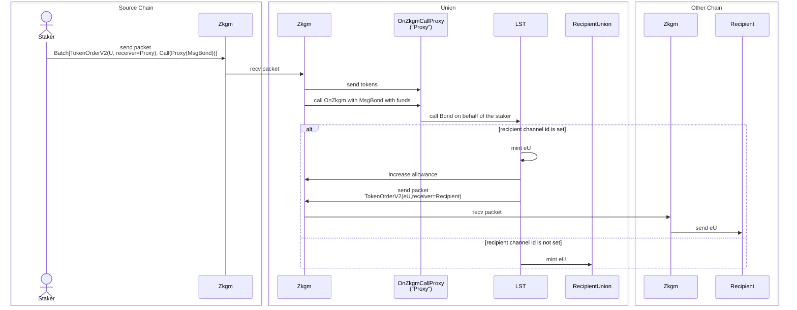

# Bond

```mermaid
sequenceDiagram
    box Source Chain
        actor Staker
        participant ZkgmSource as Zkgm
    end
    box Union
        participant ZkgmUnion as Zkgm
        participant OnZkgmCallProxy as OnZkgmCallProxy<br/>("Proxy")
        participant LST
        participant RecipientUnion
    end
    box Other Chain
        participant ZkgmOther as Zkgm
        participant RecipientOther as Recipient
    end
    Staker ->> ZkgmSource: send packet<br/>Batch[TokenOrderV2(U, receiver=Proxy), Call(Proxy(MsgBond))]
    ZkgmSource ->> ZkgmUnion: recv packet
    ZkgmUnion ->> OnZkgmCallProxy: send tokens
    ZkgmUnion ->> OnZkgmCallProxy: call OnZkgm with MsgBond with funds
    OnZkgmCallProxy ->> LST: call Bond on behalf of the staker
    alt recipient channel id is set
        LST ->> LST: mint eU
        LST ->> ZkgmUnion: increase allowance
        LST ->> ZkgmUnion: send packet<br/>TokenOrderV2(eU,receiver=Recipient)
        ZkgmUnion ->> ZkgmOther: recv packet
        ZkgmOther ->> RecipientOther: send eU
    else recipient channel id is not set
        LST ->> RecipientUnion: mint eU
    end
```
